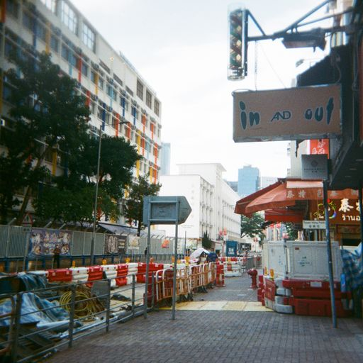

<html lang="en">
<head>
<body>
<h1 style="text-align:center;">Here’s Shirley Kwan</h1>

<h2>About me</h2>
<p1>I am Shirley Kwan who studying in course <a href="https://www5.scope.edu/programmes/bachelors-degree-top-up/bsc-hons-information-technology-business">Fundamentals of Business Programming</a>that set up by Coventry University.</p1>

<h3>-My study objectives and reflection -</h3>
  

My first objectives is to gain knowledge and skills of basic computing that can benefit me in my future careers and personal lives.
  And the second study objective is to improve different skills during the lesson and practicing 
  as studying in IT can mainly will mainly use three skills,technical skills,problem-solving skills and communication skills.
I hope i can have a visible improvment after next semester.

 
my current capabilities are not yet match my aspirations,to increase my capabilities,I would like to try more and practice more on it.
  Additionally,I will ask more questions when I facing difficulties as professors are more experienced and can give me a helpful suggestions on what I am doing.

On week 1,we've try to make a taichi in a tkinter window, at first i don't understand why isn't it just finished by draw a circle but finished by two different half circles and two small circles.
After the explanation by tutor, we understand that computers are not smart as our expectations ,we still need to clarify every step for it.
In case of this we need to clarify what kind of function are needed and the expected outcome.

<h4>-My hobby-</h4>
 
i like to take photos with my film camera with my friends in my free time and singing,dancing also .In addition,i like to watch kpop videos in my free time too,it bring a lot of fun to me.

 <h4><u>Here some photos that shoots by me<u></h4>
  <table>
<tr>
 <td></td>
 <td></td>
   </tr>
   <tr>
    <td></td>
    <td></td>
   </tr>
   <td></td>
   <td></td>
  </tr>
  </table>
   
   
   
   
   
   
   
   

Know more about me through my social media!

  

 
</head>
</body>
</html>
