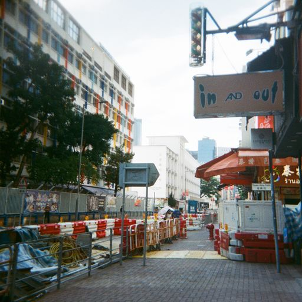
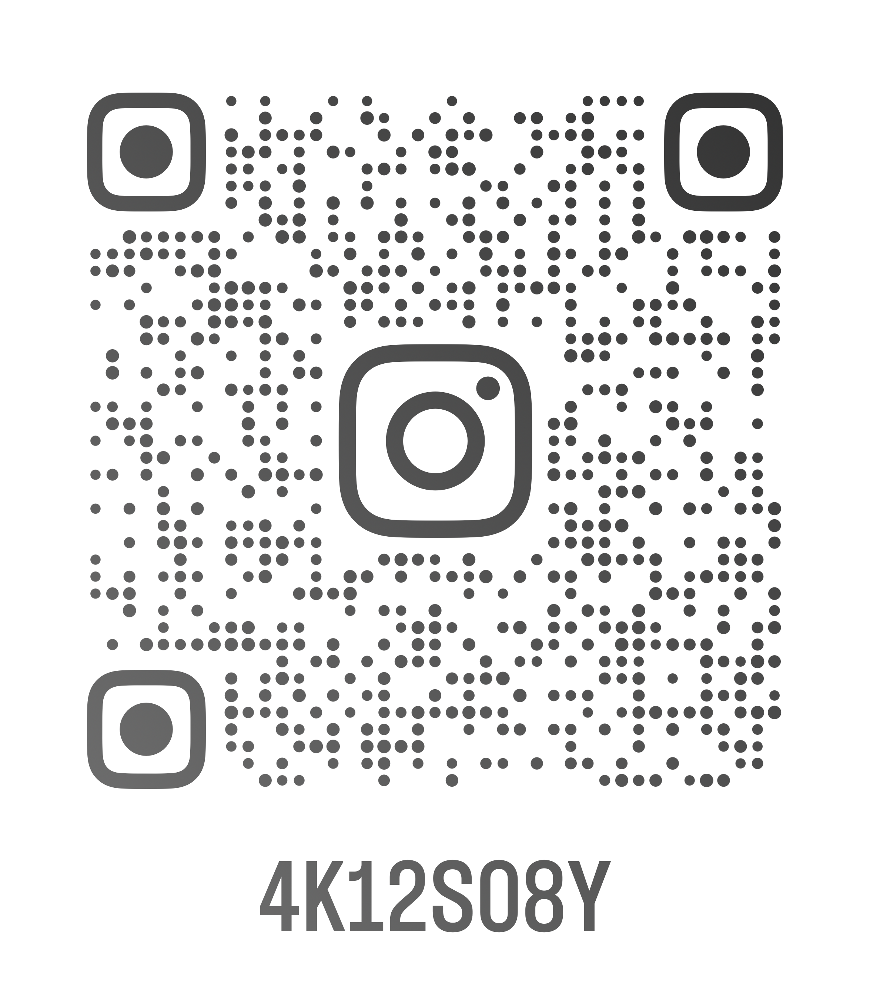

<html lang="en">
<head>
<body>
<h1 style="text-align:center;">Here’s Shirley Kwan</h1>

<h2>About me</h2>

I am Shirley Kwan who studying in course <a href="https://www5.scope.edu/programmes/bachelors-degree-top-up/bsc-hons-information-technology-business">Fundamentals of Business Programming</a>that set up by Coventry University.

 <h3>-My hobby-</h3>
 
i like to take photos with my film camera with my friends in my free time and singing,dancing also .In addition,i like to watch kpop videos in my free time too,it bring a lot of fun to me.

 <h4><u>Here some photos that shoots by me<u></h4>
  <table>
<tr>
 <td></td>
 <td></td>
   </tr>
   <tr>
    <td></td>
    <td></td>
   </tr>
   <td></td>
   <td></td>
  </tr>
  </table>
  <h5>-My study objectives-</h5>
  
My first objectives is to gain knowledge and skills of basic computing that can benefit me in my future careers and personal lives.And the second study objective is to 
   
   
   
   
   
   
   
   
   
   

Know more about me through my social media!

  

 
</head>
</body>
</html>
